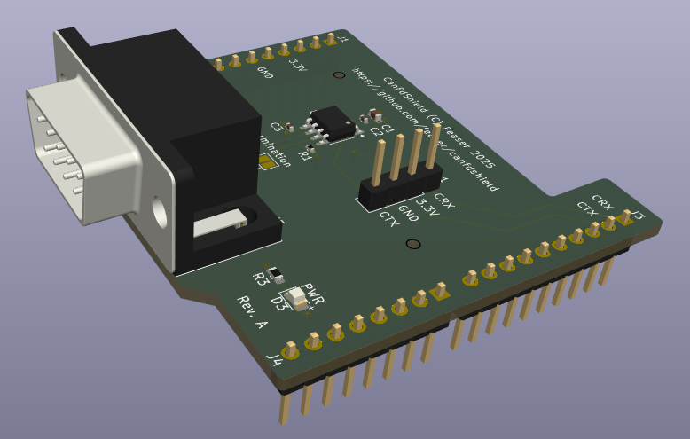
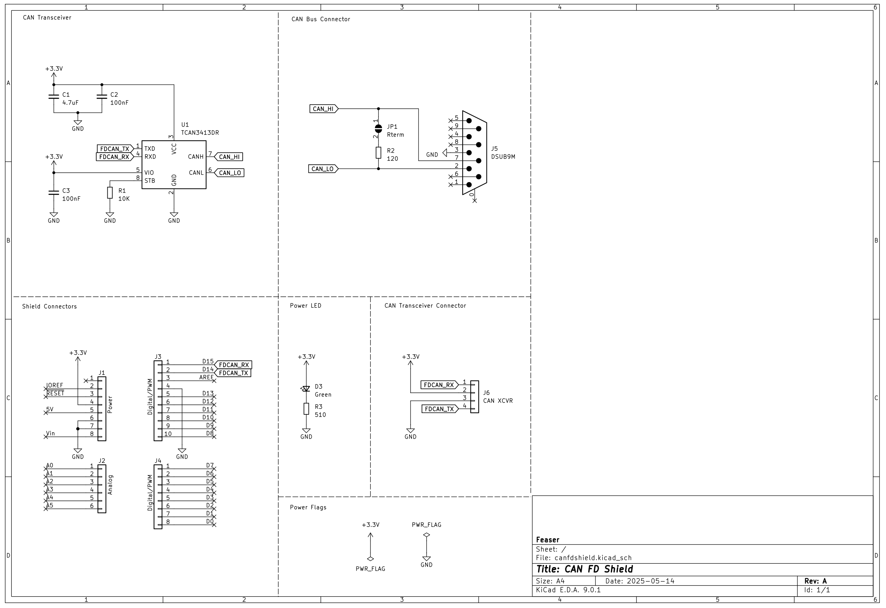
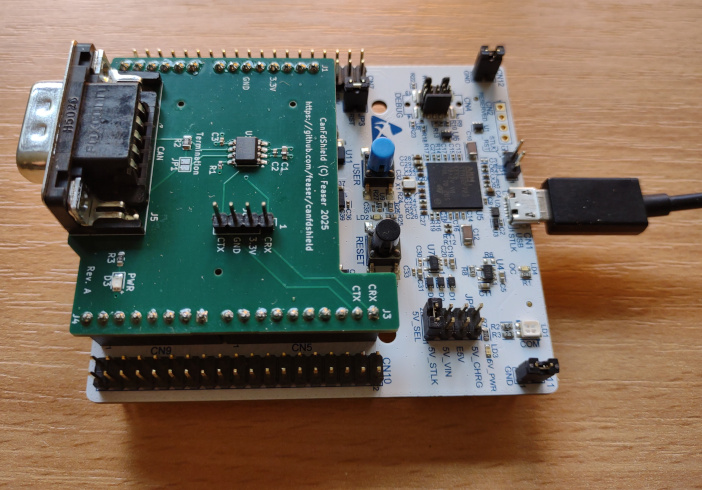

# CanFdShield

CanFdShield is an expansion board with a CAN FD transceiver, specifically designed for ST Nucleo-64 and Nucleo-144 boards. It features the standard Arduino shield connector layout, making it easy to install this expansion board on your Nucleo board.

With CanFdShield you can connect your ST Nucleo board to a CAN bus. This assumes that the STM32 microcontroller features a CAN or CAN FD controller with CAN-RX on connector pin D15 and CAN-TX on D14. 

The [Texas Instruments TCAN3413DR](https://www.ti.com/product/TCAN3413/part-details/TCAN3413DR) CAN FD transceiver was integrated into the design. This 3.3V CAN transceiver works with classical CAN and optimized CAN FD performance at 2, 5, and 8 Mbps.

This board was designed with [KiCad](https://www.kicad.org/) and you can find all schematic and PCB design files in the `.\hardware` directory. You are free to use this design for your own projects. 

For testing and verification purposes, the PCB was manufactured and assembled by [JLCPCB](https://jlcpcb.com/). It's fully functional. This is what it looks like when installed on a Nucleo-64:

If you would like to order a batch yourself, you can find the Gerber files in `.\hardware\gerber`. You'll also need the BOM and footprint position files. These are located in `.\hardware\assembly`.
